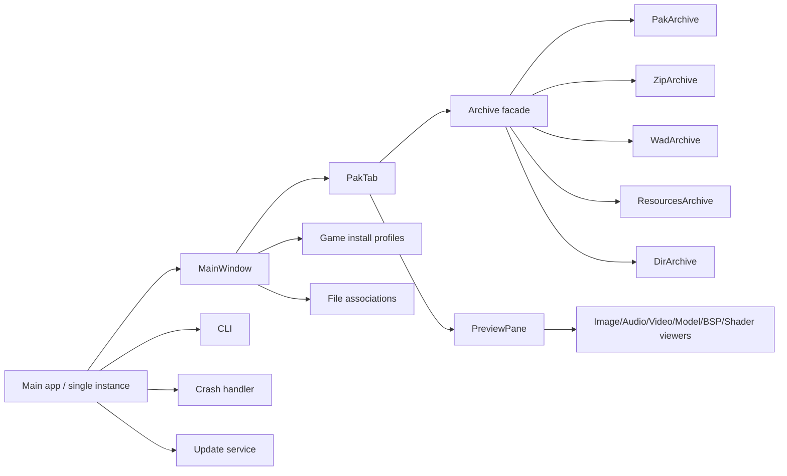
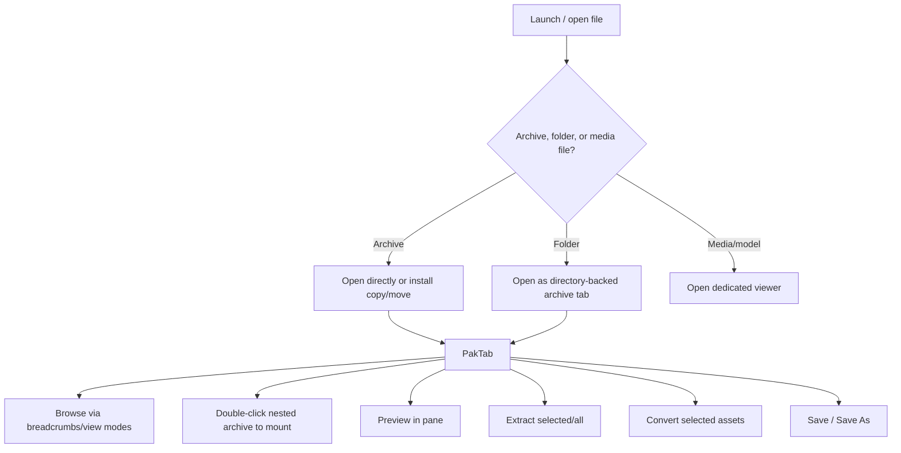

# PakFu as an Archive Manager and idTech Asset Viewer

## Executive summary

PakFu is an unusually ambitious desktop tool: one cross-platform application that aims to be both an archive workbench and a media/asset viewer across the entity["video_game","Quake","1996 fps"] → entity["video_game","Quake II","1997 fps"] → entity["video_game","Quake III Arena","1999 fps"] → entity["video_game","Doom 3","2004 fps"] family, plus adjacent titles. The repository snapshot supports that claim at a high level: the README advertises broad archive coverage, dedicated viewers, nested containers, conversion, install profiles, updater/crash reporting, and cross-platform packaging; the build graph shows a large but coherent codebase split into `archive`, `formats`, `ui`, `game`, `platform`, `update`, and archive-format modules. fileciteturn40file0L1-L1 fileciteturn37file0L1-L1

The strongest parts of the project are breadth and product thinking. It already has a real desktop UX with tabbed archive browsing, drag/drop, undo/redo, recent files, per-game installation profiles, dedicated image/audio/video/model windows, BSP and shader preview paths, a single-instance shell-open flow, Windows file associations, release packaging for Windows/macOS/Linux, and CI that builds and validates artifacts on all three platforms. These are not toy-project signals. fileciteturn51file0L1-L1 fileciteturn55file0L1-L1 fileciteturn34file0L1-L1 fileciteturn57file0L1-L1

The main weaknesses are architectural maturity and verification depth. The code is feature-rich, but not yet shaped like a hardened platform. Write/rebuild support is asymmetric across formats, with some persistence logic living in `PakTab` UI code rather than in isolated backend writer classes; the CLI is useful but narrow; the current CI validation is mostly smoke-level; I did not find a dedicated unit-test or fuzzing regimen; and some of the broadest feature claims are only partially verifiable from the static snapshot because the entry points are obvious but deeper behavioral proof would require runtime testing. fileciteturn45file0L1-L1 fileciteturn47file0L1-L1 fileciteturn53file0L1-L1 fileciteturn58file0L1-L1

My bottom-line judgment is that PakFu already looks credible as a serious integrated idTech asset workbench, especially for browse/inspect/extract/open workflows. It is less convincing today as the definitive “all-round archive manager” because the testing story, plugin/extensibility story, and backend isolation story lag behind its product ambition. In other words: promising and already useful, but still closer to a powerful alpha/beta workbench than to a hardened long-horizon platform. fileciteturn40file0L1-L1 fileciteturn37file0L1-L1 fileciteturn57file0L1-L1

## Scope and evidence base

This report is based on static analysis of the repository snapshot, starting from the user-enabled entity["company","GitHub","developer platform"] connector for `themuffinator/PakFu`, and then cross-checking external comparisons against official/primary sources for Noesis and PeaZip. I did **not** perform runtime execution, packaging installation, or corpus-based malformed-file testing in this pass, so performance, rendering fidelity, and crash resistance are assessed from code structure and observable implementation patterns rather than measured behavior. fileciteturn40file0L1-L1 fileciteturn37file0L1-L1 citeturn7search1turn7search2turn8search1

The repository’s top-level implementation signals are strong and easy to locate: `meson.build` and `src/meson.build` define a C++20 + entity["company","Qt","cross-platform sdk"] 6 application with explicit modules for archive formats, preview/rendering, UI windows, crash handling, update checks, and game-install management. The release docs and nightly workflow describe a multi-platform build/validate/package/release pipeline. fileciteturn36file0L1-L1 fileciteturn37file0L1-L1 fileciteturn60file0L1-L1 fileciteturn57file0L1-L1

A useful way to think about the current architecture is this:

That decomposition is visible directly in the build graph and in the `main.cpp` / `main_window.cpp` entry points. fileciteturn37file0L1-L1 fileciteturn43file0L1-L1 fileciteturn51file0L1-L1

## Feature completeness and implementation state

PakFu’s claims are broad, and many of them are substantiated. The core archive-open path is real: the `Archive` facade dispatches to directory, PAK/SIN, WAD, resources, and ZIP-family backends, with heuristic fallback if the extension is misleading. The CLI exposes `--list`, `--info`, `--extract`, update checks, and game-install selection/detection. The UI exposes save, save-as, extract selected/all, recent files, preferences, and archive/file/folder open actions. fileciteturn42file0L1-L1 fileciteturn41file0L1-L1 fileciteturn51file0L1-L1

A key architectural observation is that the codebase is **not** uniformly backend-driven. `PakArchive` is a self-contained reader/writer with `load`, `save_as`, and `write_empty`. By contrast, the `WadArchive` and `ZipArchive` headers are read/extract-focused, while `PakTab` declares `write_pak_file`, `write_wad2_file`, and `write_zip_file`, suggesting that some write/rebuild logic happens in the UI layer. That does not mean those features are absent; it means they are harder to verify and test independently, and it increases coupling between desktop workflow code and archive serialization. fileciteturn45file0L1-L1 fileciteturn46file0L1-L1 fileciteturn47file0L1-L1 fileciteturn26file0L1-L1 fileciteturn53file0L1-L1

### Feature verification matrix

| Claimed capability | Static verification | Evidence | Priority | Recommendation |
|---|---|---|---|---|
| Cross-platform GUI + CLI | **Verified** | README claims GUI+CLI and Windows/macOS/Linux; `main.cpp` switches between GUI and CLI; nightly workflow builds all three OSes. fileciteturn40file0L1-L1 fileciteturn43file0L1-L1 fileciteturn57file0L1-L1 | Low | Keep CLI parity in view as GUI expands. |
| Archive open/list/extract for folder, PAK/SIN, ZIP family, resources, WAD | **Verified** | `Archive::load` dispatches all listed formats; CLI implements info/list/extract against `Archive`. fileciteturn42file0L1-L1 fileciteturn41file0L1-L1 | Low | Add corpus-based round-trip tests per format. |
| PAK/SIN save/rebuild | **Verified** | `PakArchive` implements `save_as` and `write_empty`; UI exposes New PAK and Save/Save As. fileciteturn45file0L1-L1 fileciteturn46file0L1-L1 fileciteturn51file0L1-L1 | Medium | Move more persistence tests to backend-only coverage. |
| ZIP-family save/rebuild | **Partially verified** | README says yes; `PakTab` exposes ZIP write methods and Save As filters for PK3/PK4/PKZ/ZIP, but the fetched `ZipArchive` header is read/extract-centric. fileciteturn40file0L1-L1 fileciteturn53file0L1-L1 fileciteturn51file0L1-L1 fileciteturn28file0L1-L1 | High | Isolate ZIP write code into a backend writer class and add round-trip fixtures. |
| WAD2 save/rebuild; WAD3/Doom WAD read-only | **Partially verified but plausible** | README claims WAD2 write, WAD3/Doom WAD read-only; `WadArchive` header is read/extract only; `PakTab` declares `write_wad2_file`; Save As restricts WAD to WAD2-style output. fileciteturn40file0L1-L1 fileciteturn47file0L1-L1 fileciteturn53file0L1-L1 fileciteturn51file0L1-L1 | High | Same as ZIP: move WAD writing out of UI and test separately. |
| Nested containers / mounted archives | **Verified** | README calls out nested container mounting; `PakTab` has mounted archive stack state and mount helpers. fileciteturn40file0L1-L1 fileciteturn53file0L1-L1 | Medium | Add breadcrumbed container-layer indicators and unload/mount telemetry. |
| Dedicated image/audio/video/model windows | **Verified** | README claims dedicated windows; build graph includes those windows; `MainWindow` routes supported media files to dedicated viewers. fileciteturn40file0L1-L1 fileciteturn37file0L1-L1 fileciteturn51file0L1-L1 | Low | Preserve this separation; it is a product strength. |
| Broad preview/inspector coverage for text, shader, sprite, BSP, model, font, video, audio | **Verified at entry-point level** | `PreviewPane` exposes pages and handlers for text/script, shader, font, binary, image, sprite, BSP, audio, cinematic, video, and model content. fileciteturn55file0L1-L1 | Medium | Add explicit support matrix docs tied to fixture files and screenshots. |
| Batch conversion | **Partially verified** | README claims broad batch conversion; UI action exists and `PakTab` exposes `convert_selected_assets`, but conversion internals were not inspected fully. fileciteturn40file0L1-L1 fileciteturn53file0L1-L1 fileciteturn51file0L1-L1 | Medium | Publish conversion test matrix and known limitations by format. |
| Game install auto-detect/profiles | **Verified** | README and CLI support list/auto-detect/select install; build includes `game_auto_detect.cpp`; `MainWindow` restores workspace per install. fileciteturn40file0L1-L1 fileciteturn41file0L1-L1 fileciteturn37file0L1-L1 fileciteturn51file0L1-L1 | Medium | Expose install-detection logs in UI and allow per-install validation/repair. |
| Crash reporting and updater | **Verified** | Crash handler writes session logs and Windows minidumps; updater is configured from build options and started from GUI/CLI. fileciteturn56file0L1-L1 fileciteturn38file0L1-L1 fileciteturn43file0L1-L1 fileciteturn41file0L1-L1 | Medium | Add artifact integrity verification and publish trust model clearly. |
| File association UI | **Verified with platform caveat** | Windows registry integration is implemented; non-Windows path is “installer-managed on this platform.” fileciteturn34file0L1-L1 | Medium | Provide explicit Linux/macOS association docs and installer hooks. |

The implementation footprint is substantial and well-organized enough to scale, but it already shows some tension between “application code” and “library code.” The current codebase is rich in end-user behavior and desktop affordances; it is not yet equally rich in isolated backend contracts. That matters because broad format support eventually becomes a testing and maintenance problem more than a coding problem. fileciteturn37file0L1-L1 fileciteturn53file0L1-L1

## UX and functionality assessment

For common workflows, PakFu looks more polished than many hobbyist asset viewers. The opening flow is flexible: the app distinguishes archives, folders, and viewable files; supported media routes to dedicated viewers; archives can be opened directly or copied/moved into a selected game installation; recent files and per-install workspaces are remembered; and shell/file-association reopens are routed through single-instance IPC so subsequent launches focus the existing window. That is thoughtful desktop behavior. fileciteturn43file0L1-L1 fileciteturn51file0L1-L1

Browsing inside archives is also meaningfully beyond a bare list view. `PakTab` supports breadcrumbs, multiple browser view modes, drag/drop, undo/redo, cut/copy/paste/rename, collision prompts, extraction, conversion, virtual directories, mount layers, and a preview pane. The QA checklist explicitly targets selection semantics, drag/drop modifier policies, tab-to-tab movement, and lock-state gating, which is good evidence that the author is thinking about real file-manager ergonomics rather than only format parsing. fileciteturn53file0L1-L1 fileciteturn59file0L1-L1

For idTech assets specifically, the preview story is broad. The preview pane has dedicated content modes for images, sprite animation, audio, cinematics, video, BSP, model, shader, font, text, and generic binary content; the README and dependency notes enumerate built-in loaders/inspectors across textures, Doom/Quake-style image formats, cinematic formats, multiple mesh families, shader and script assets, font insight views, and Bytecode/metadata inspectors for several engine-era formats. What I cannot confirm statically is **fidelity quality**: whether models always resolve skins/materials correctly, whether maps look correct under all BSP variants, and how robustly game-install context is used to resolve dependent resources. fileciteturn55file0L1-L1 fileciteturn40file0L1-L1 fileciteturn39file0L1-L1

A representative workflow looks like this:

This is consistent with the menu wiring and archive-open chooser code. fileciteturn51file0L1-L1

### UX assessment matrix

| Area | Finding | Evidence | Priority | Actionable recommendation |
|---|---|---|---|---|
| Opening archives | Flexible but potentially a little heavy for quick inspection because the archive chooser can prompt direct/open/install/move decisions. | Archive-open chooser and install routing are first-class in `MainWindow`. fileciteturn51file0L1-L1 | Medium | Add a “Quick Inspect” default path for unknown external archives, with a smaller secondary affordance for install-copy/move. |
| Archive browsing | Strong basics: tabs, breadcrumbs, multiple views, recent files, per-install workspace restore. | `MainWindow` and `PakTab` state show those behaviors directly. fileciteturn51file0L1-L1 fileciteturn53file0L1-L1 | Low | Keep; this is already one of PakFu’s differentiators. |
| Editing workflows | Good desktop conventions: drag/drop, cut/copy/paste, undo/redo, collision dialogs, locked-state gating. | `PakTab` API and QA checklist support the claim. fileciteturn53file0L1-L1 fileciteturn59file0L1-L1 | Low | Add visible operation history and conflict-resolution presets. |
| Asset viewing | Broad preview surface area, including BSP/model/shader-specific affordances. | `PreviewPane` is multi-modal and specialized. fileciteturn55file0L1-L1 | Medium | Add “dependency health” panels for unresolved skins/shaders/textures and expose source-path resolution logic. |
| Discoverability | I did not find an obvious global search/filter/index feature in the inspected entry points. | Not visible in `MainWindow` menu/state APIs or `PakTab` interface snapshot. fileciteturn51file0L1-L1 fileciteturn53file0L1-L1 | High | Add instant filename/path filtering, material/model dependency search, and “find across mounted containers.” |
| Modern conventions | Native dialogs, drag/drop overlays, document tabs, preferences, dedicated viewers, and fullscreen all align well with modern desktop expectations. | README and `MainWindow` / `PreviewPane` confirm these patterns. fileciteturn40file0L1-L1 fileciteturn51file0L1-L1 fileciteturn55file0L1-L1 | Low | Add command palette, quick-open, and keyboard shortcut reference. |
| Map-centric workflows | Map/BSP support is present, but current emphasis appears to be preview/inspection rather than deep map authoring or entity editing. | BSP preview exists; no evidence in inspected files of full map-editing workflows. fileciteturn55file0L1-L1 fileciteturn39file0L1-L1 | Medium | Add lump/entity explorers, diff views, and “open in external editor” hooks for map specialists. |

## Performance and resource efficiency

Because this is static analysis, I cannot give benchmark numbers. What I can say with confidence is that parts of the implementation are resource-aware. `PakArchive` loads only metadata into memory, validates offsets and lengths against file size, and streams extraction/writing through `QSaveFile` in 64 KiB chunks rather than slurping the archive wholesale. That is a sound baseline for classic archive handling. fileciteturn46file0L1-L1

The project also uses background-capable UI patterns. `PakTab` owns a `QThreadPool` for thumbnail work, export temp directories, sprite animation state, and multiple cached preview states for BSP and model content. That suggests the author is already thinking in terms of asynchronous UI responsiveness, although the static snapshot does not show enough of the thumbnail job implementation to judge caching policy or cancellation quality comprehensively. fileciteturn53file0L1-L1 fileciteturn55file0L1-L1

There are, however, a few clear structural bottlenecks. `PakArchive::find_entry` performs a linear scan rather than using a name index; `Archive::read_entry_bytes` and `Archive::extract_entry_to_file` take a mutex around the whole backend dispatch; and the main GUI startup path can hold the splash screen until the updater returns, meaning network/update latency can gate perceived startup time. None of these are fatal, but together they point to a product that will feel best on small-to-medium workloads before it feels great on very large mod trees or high-latency environments. fileciteturn46file0L1-L1 fileciteturn42file0L1-L1 fileciteturn43file0L1-L1

### Static performance assessment

| Finding | Evidence | Priority | Recommendation |
|---|---|---|---|
| Metadata-first archive loading is sensible. | `Archive` backends expose entry vectors; PAK loader validates headers and stores metadata, not full files. fileciteturn42file0L1-L1 fileciteturn46file0L1-L1 | Low | Keep this pattern across all format backends. |
| Streaming writes/extracts are good for memory use. | `PakArchive` uses chunked copy and `QSaveFile` for atomic writes. fileciteturn46file0L1-L1 | Low | Standardize the same chunked strategy for every writer path. |
| Name lookup in PAK is O(n). | `PakArchive::find_entry` scans the `entries_` vector. fileciteturn46file0L1-L1 | Medium | Build a `QHash<QString,int>` index at load time. |
| Archive facade serializes reads/extracts under one mutex. | `Archive` takes a `QMutexLocker` around whole operations. fileciteturn42file0L1-L1 | Medium | Narrow lock scope or split read-only metadata from payload access paths. |
| Startup UX can be network-latency bound. | Splash shows “Checking for updates…” and `finish_and_show` occurs after update callback. fileciteturn43file0L1-L1 | High | Show the main window immediately, move update results to a non-blocking notification surface. |
| Packaging footprint will be heavier than classic archivers. | Qt Multimedia/OpenGL/OpenGLWidgets/Network plus platform packaging imply a large runtime bundle. fileciteturn36file0L1-L1 fileciteturn39file0L1-L1 fileciteturn57file0L1-L1 | Medium | Offer “viewer-lite” and “full multimedia” packages or optional component installs. |

## Integration, security, and robustness

On integration, PakFu already behaves like a real desktop citizen. `MainWindow` accepts drag/drop from local files and folders, deduplicates dropped paths, routes them to the right open mode, and supports tab-bar drag/drop integration into `PakTab`. `main.cpp` implements a per-user single-instance IPC server so file associations and repeated shell opens focus the running instance rather than spawning duplicates. That is mature behavior for a desktop archive browser. fileciteturn51file0L1-L1 fileciteturn43file0L1-L1

Windows integration is notably stronger than non-Windows integration. The file-association subsystem generates per-extension icons and writes current-user registry entries for “Open with” integration on Windows, while explicitly reporting that associations are installer-managed on other platforms. Packaging, on the other hand, is platform-complete: MSI/ZIP for Windows, PKG/ZIP for macOS, AppImage/tar.gz for Linux. The picture, then, is a cross-platform shipping story with a Windows-first shell-integration story. fileciteturn34file0L1-L1 fileciteturn40file0L1-L1 fileciteturn60file0L1-L1 fileciteturn57file0L1-L1

The CLI is useful but not yet comprehensive. It covers listing, info, extraction, updates, practical QA, and install-profile management, but it does not expose the richer GUI behaviors such as save/rebuild control, conversion, mount operations, or deep preview export. For knowledge-worker or pipeline use, that means PakFu is script-*aware* rather than script-*complete*. fileciteturn41file0L1-L1

Security and robustness are mixed in a good-but-not-complete way. The code shows multiple healthy practices: safe path normalization, rejection of unsafe archive entry names, out-of-bounds checks, skip-on-unsafe extraction in the CLI, atomic output writes, session logging, and Windows crash minidumps. Against that, I did not find evidence in the inspected materials of fuzzing, sanitizer CI, or parser-specific malicious corpus tests, and the reliance on Qt Multimedia backends/FFmpeg availability widens the attack and compatibility surface for media playback. fileciteturn41file0L1-L1 fileciteturn46file0L1-L1 fileciteturn56file0L1-L1 fileciteturn39file0L1-L1

### Integration and robustness matrix

| Area | Finding | Evidence | Priority | Actionable recommendation |
|---|---|---|---|---|
| OS integration | Strong on Windows; more installer-dependent elsewhere. | File associations are implemented in Windows registry code and stubbed as installer-managed on non-Windows. fileciteturn34file0L1-L1 | Medium | Add Linux desktop-file / MIME XML and macOS UTI/document-type source artifacts to the repo. |
| Drag/drop and shell-open flows | Strong and practical. | `MainWindow` handles external drops, tab-bar drops, and single-instance IPC open requests. fileciteturn51file0L1-L1 fileciteturn43file0L1-L1 | Low | Keep; add telemetry or debug logging for failed route decisions. |
| CLI/API | CLI exists, but there is no obvious public library API or plugin layer. | CLI options are limited to archive info/list/extract, updates, QA, and install profiles; build graph shows compile-time modules, not a plugin contract. fileciteturn41file0L1-L1 fileciteturn37file0L1-L1 | High | Define a stable core library and a plugin ABI or script layer for format/viewer extensions. |
| Archive path safety | Good baseline hardening for extracted names and in-archive PAK names. | CLI uses path safety and skips unsafe entries; PAK loader sanitizes names and rejects unsafe paths. fileciteturn41file0L1-L1 fileciteturn46file0L1-L1 | Low | Extend the same explicit safety-reporting pattern to all format backends and GUI extraction paths. |
| Crash diagnostics | Stronger than average for a hobby-scale desktop tool. | Session log hook, crash directory, Windows stack traces, and minidumps are implemented. fileciteturn56file0L1-L1 | Medium | Add optional symbol upload / human-readable crash bundle docs for users. |
| Parser hardening | Likely adequate for ordinary files, but insufficiently proven against malformed adversarial corpora. | Validation is smoke-based; no fuzzing or parser-heavy test suite is visible in the inspected materials. fileciteturn58file0L1-L1 fileciteturn59file0L1-L1 | High | Add libFuzzer/AFL harnesses for PAK/WAD/ZIP/resources/image/model decoders and run sanitizers in CI. |
| Update trust model | Functional, but I did not inspect client-side integrity verification in this pass. | Updater is first-class in README, build options, and startup/CLI flow; release docs mention manifests/checksums. fileciteturn40file0L1-L1 fileciteturn38file0L1-L1 fileciteturn43file0L1-L1 fileciteturn60file0L1-L1 | High | Verify signatures/checksums client-side before install handoff and document the policy. |

## Roadmap, maintenance, and comparative position

PakFu’s maintenance story is stronger than its testing story. On the positive side, the repository has a clear versioning policy, nightly automation, release asset validation, changelog generation, and packaging rules for all target platforms. That is a disciplined release pipeline for a small project. On the negative side, the actual build validation is still smoke-weight by default: `validate_build.py` checks `--cli --version`, `--cli --help`, and only optionally runs the UI practical QA harness. I did not find evidence in the inspected files of a broad unit-test tree, fixture corpus, or formal contribution process equivalent to the release process. fileciteturn60file0L1-L1 fileciteturn57file0L1-L1 fileciteturn58file0L1-L1

That asymmetry affects strategic position. Compared with a specialist viewer like Noesis, PakFu is more opinionated as a desktop archive workbench and has a stronger integrated archive-browser UX. Compared with a mature archive manager like PeaZip, PakFu is far more specialized for game assets and previews, but it is much less mature as a general-purpose archive ecosystem. This is exactly where PakFu is most interesting: it is trying to occupy the middle ground that many modding workflows actually need. fileciteturn40file0L1-L1 citeturn7search1turn7search2turn7search4turn8search1turn8search4

### Comparison table

| Tool | Archive/browser orientation | Asset/media orientation | Extensibility | Platform stance | Best use relative to PakFu | Evidence |
|---|---|---|---|---|---|---|
| PakFu | Integrated archive manager with open/save/extract/rebuild UX, nested mounts, drag/drop, install profiles, and file-manager semantics. | Broad idTech-family preview/inspection surface, including images, sprites, audio, video, models, BSP, shader, and text/script assets. | No clear public plugin API in inspected snapshot; extension appears compile-time. | Windows/macOS/Linux with packaged releases and CI. | Best when you want one integrated desktop workbench for archives **and** game assets. | fileciteturn40file0L1-L1 fileciteturn37file0L1-L1 fileciteturn51file0L1-L1 fileciteturn55file0L1-L1 |
| Noesis | Can extract many archives, but its own manual says there are no plans for a general archive viewer/browser in the core product. | Extremely strong model/image/animation preview/conversion tooling, with Data Viewer and export tooling. | Strong plugin/script story via native modules and Python scripts. | Windows-focused. | Best when deep format coverage and extensibility matter more than archive-manager UX. | citeturn7search1turn7search2turn7search4 |
| PeaZip | Mature cross-platform archive manager with browsing, preview, extraction, conversion, encryption, and general file-manager features across 200+ archive types. | Limited relative to PakFu for idTech-specialized viewing; it is a general archiver, not a game-asset preview studio. | Broad archive ecosystem/tooling, but not an idTech-specific asset plugin platform in the way Noesis is. | Cross-platform and portable. | Best when hardened general archive workflows matter more than specialized game-asset understanding. | citeturn8search1turn8search4turn8search5 |

### Priority roadmap I would recommend

| Priority | Recommendation | Why it matters |
|---|---|---|
| Highest | Move ZIP/WAD write logic into backend writer classes with dedicated round-trip test fixtures. | This reduces UI coupling and makes the archive manager claim much stronger. |
| Highest | Add parser fuzzing + sanitizers for PAK/WAD/ZIP/resources/images/models/cinematics. | Breadth without hostile-file hardening becomes a liability as adoption grows. |
| High | Build a search/index layer for filenames, paths, mounted containers, and dependency resolution. | This is the biggest UX gap for large asset sets. |
| High | Expand CLI to cover conversion, mount/extract subsets, save-as format selection, and preview-export routines. | It would make PakFu useful in pipelines, not just at the desktop. |
| High | Make update checks fully non-blocking and verify artifacts client-side before handoff. | Better startup UX and stronger supply-chain posture. |
| Medium | Publish a fixture-backed support matrix with “supported / preview-only / read-only / write-supported” per format. | The repo already claims a lot; this would turn breadth into trust. |
| Medium | Introduce a plugin or scripting extension layer. | This is where PakFu most obviously trails Noesis and where community leverage could accelerate coverage. |

## Open questions and limitations

This assessment did not include live runtime testing, packaged installer validation, GPU renderer comparison, malformed archive fuzzing, or corpus-based quality checks for textures/models/maps/audio/video. As a result, I can judge architecture and intent more confidently than I can judge rendering fidelity, codec reliability, write-path correctness under all edge cases, or memory/CPU behavior on very large real-world mod sets. fileciteturn55file0L1-L1 fileciteturn57file0L1-L1

I also did not conduct a commit-by-commit historical audit in this pass. The maintenance conclusions therefore rely on the current `main` snapshot, the release/versioning documentation, and the CI workflows rather than on a deep provenance analysis of individual commits. fileciteturn60file0L1-L1 fileciteturn57file0L1-L1

Even with those limits, the high-confidence conclusion stands: PakFu is already more than a format demo. It has real product breadth and a real desktop workflow. The next step is not “add more surface area”; it is to convert impressive surface area into provable, testable, extensible reliability. fileciteturn40file0L1-L1 fileciteturn58file0L1-L1