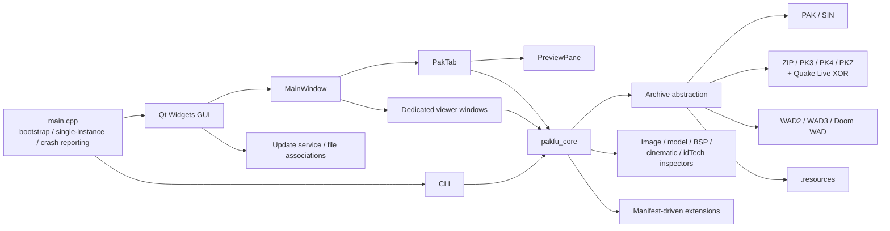

# PakFu as an idTech Asset Archive Manager and Viewer

## Executive Summary

PakFu is not a toy PAK browser. On static inspection, it is a substantial C++20 / Qt6 desktop application with a modular non-UI core, GUI and CLI front ends, multi-format archive backends, dedicated media viewers, idTech-specific parsers, cross-platform packaging automation, and a real test surface that now includes smoke tests, support-matrix fixtures, and optional libFuzzer targets. The repository’s own support contract and code structure support a strong claim that PakFu is already a serious archive manager and asset viewer for a wide slice of idTech-era content. fileciteturn90file0L1-L1 fileciteturn91file0L1-L1 fileciteturn97file0L1-L1 fileciteturn98file0L1-L1

The strongest parts of the project are its breadth of archive support, selective rebuild/write capability for the right formats, integrated preview surface for images/audio/video/models/text/fonts/shaders/BSP, a useful CLI, manifest-driven extensions, and modern release automation for Windows, macOS, and Linux. In other words, PakFu already clears the bar for “all-round archive manager” much better than many game-asset utilities that are either viewer-first or extractor-first. fileciteturn90file0L1-L1 fileciteturn98file0L1-L1 fileciteturn84file0L1-L1 fileciteturn81file0L1-L1

The main qualification is uneven depth. PakFu’s map handling is strong for entity["video_game","Quake","1996 first-person shooter"], entity["video_game","Quake II","1997 first-person shooter"], and entity["video_game","Quake III Arena","1999 arena shooter"] BSP families, including several derived formats, but I did not find equally clear evidence of a dedicated idTech4 compiled-map viewer for the entity["video_game","Doom 3","2004 first-person shooter"] era. The repository clearly handles many Doom 3 / BFG assets and containers, but the “maps for idTech1–4” claim should currently be read as asymmetric: strong for Quake-family BSPs, much less clearly implemented for Doom 3 / Quake 4 map visualization. fileciteturn86file0L1-L1 fileciteturn89file0L1-L1 fileciteturn90file0L1-L1

From a product standpoint, the highest-priority improvements are not “start from scratch” problems. They are focused: clarify and extend idTech4 map support, separate release automation from mandatory pull-request quality gates, harden extension execution and malformed-input coverage, improve cross-platform shell integration consistency, and clean repository hygiene. Those changes would move PakFu from “ambitious and already useful” to “credible default desktop workbench for classic idTech assets.” fileciteturn81file0L1-L1 fileciteturn83file0L1-L1 fileciteturn85file0L1-L1 fileciteturn95file0L1-L1 citeturn12view3

| Area | Bottom line | Priority |
|---|---|---|
| Feature scope | Broad and real, but not equally deep across all idTech generations | High |
| Implementation state | Modular, testable, and much more mature than README marketing alone suggests | Medium |
| UX | Good archive-centered workflows, but some high-value polish opportunities remain | Medium |
| Performance | Sensible architecture, but temp-file and packaging overhead likely matter in real use | Medium |
| Integration | Strong GUI + CLI + extensions + installer story; API/plugin maturity still limited | Medium |
| Security | Better than hobby norm; more hardening and sandboxing would materially help | Medium |
| Maintenance | Active and documented, but still visibly small-project in process and repo hygiene | High |

## Architecture and Implementation State

PakFu’s structure is cleanly split into a core layer and an app layer. The top-level Meson project sets a C++20 baseline and hands most of the real composition to `src/meson.build`, where the code is divided into `pakfu_core`, the Qt application, small utility probes, unit/smoke tests, fixture tests, and optional fuzz targets. The core includes archive loading/extraction, archive search, resources/WAD/PAK/ZIP backends, image/model/cinematic/BSP helpers, game-profile code, and extension command handling; the GUI layer adds `MainWindow`, `PakTab`, preview widgets, viewer windows, update flow, file associations, and crash handling. That is the right separation for long-term maintainability. fileciteturn97file0L1-L1 fileciteturn98file0L1-L1 fileciteturn92file0L1-L1

`main.cpp` confirms a serious application bootstrap rather than an ad hoc demo. It supports a GUI path and a CLI path, installs crash reporting, prefers Qt’s FFmpeg multimedia backend when available, supports single-instance IPC for file openings, exposes dedicated media/model windows, and preserves a clean open-path flow for archives and direct media files. That gives PakFu strong structural footing as both a desktop app and an automation tool. fileciteturn88file0L1-L1

The test/build picture is much better than a superficial repo glance would suggest. The build declares `archive_writer_roundtrip`, `archive_search_index`, `core_api_smoke`, `extension_plugin`, and `support_matrix_fixture` tests; the documentation also points to practical GUI/archive smoke QA via `--qa-practical`; and fuzzing can be enabled for PAK, WAD, ZIP, resources, images, models, and cinematics when compiler support is available. The current CI evidence inspected most directly is the nightly workflow, which performs cross-platform build, validation, packaging, and GitHub release publication. That is meaningful engineering discipline, even if the repository would still benefit from explicit pull-request gating shown as prominently as the release pipeline. fileciteturn98file0L1-L1 fileciteturn83file0L1-L1 fileciteturn82file0L1-L1 fileciteturn81file0L1-L1

The dependency story is pragmatic rather than minimal. PakFu depends on Qt6 Core/Gui/Widgets/Network/Multimedia plus OpenGL/OpenGLWidgets, optionally uses Qt private RHI headers for the Vulkan preview path, vendors `miniz`, and relies on platform packaging tools such as `windeployqt`, `macdeployqt`, WiX, and `linuxdeployqt`. This yields a deployable cross-platform application, but it also means larger distribution artifacts and a dependency surface that should be managed intentionally over time. fileciteturn89file0L1-L1 fileciteturn97file0L1-L1 fileciteturn98file0L1-L1 fileciteturn84file0L1-L1

The following diagram reflects the architecture evidenced by the build files, core-library document, bootstrap, and UI headers. fileciteturn92file0L1-L1 fileciteturn97file0L1-L1 fileciteturn98file0L1-L1 fileciteturn88file0L1-L1



### Findings and actions

| Finding | Severity | Actionable recommendation |
|---|---|---|
| Modular split between `pakfu_core` and UI is a major strength | Low | Keep pushing parsing, archive logic, and game-profile logic into `pakfu_core` |
| Build/test surface is stronger than many niche utilities | Low | Add an always-on PR workflow that runs core tests and support-matrix fixtures on each merge |
| Vulkan preview is optional and sensibly falls back to OpenGL | Low | Keep OpenGL as the compatible baseline; document renderer differences per feature |
| `pakfu_core` is a useful seam but not yet a packaged SDK | Medium | Publish a stable public header set, versioned API notes, and sample consumer code |
| Nightly/release automation is good, but release workflows are more visible than merge gates | Medium | Require CI checks before merge and surface test results in README badges |
| Repository root shows committed build/runtime artifacts such as `_artifact_ubuntu`, `squashfs-root`, `tmp`, and `aqtinstall.log` | High | Remove generated artifacts from version control, fix ignore rules, and keep the repo source-only for contributor clarity |

The repo-hygiene observation above is directly visible from the repository root listing on entity["company","GitHub","code hosting platform"], alongside the current public activity signals of 110 commits, 1 open issue, and 0 open pull requests. citeturn12view3turn13view0

## Feature Completeness

PakFu’s archive-format story is strong and unusually explicit. The README and support matrix claim open/list/extract support for folder inputs, PAK/SIN, ZIP-family containers, Quake Live Beta encrypted PK3s, Doom 3 BFG `.resources`, WAD2, WAD3, and Doom IWAD/PWAD files. Static inspection of the archive abstraction and backend sources matches that direction: the `Archive` facade has dedicated backends for directory, PAK, WAD, resources, and ZIP, and the support matrix differentiates clearly between formats that are read/write and formats that are read-only. Most importantly, the project does **not** over-promise universal write support: save/rebuild is asserted only for PAK/SIN, ZIP-family formats, encrypted PK3 save-as, and WAD2, while `.resources`, WAD3, and Doom WAD are explicitly read-only. That is a strong sign of technical honesty. fileciteturn96file0L1-L1 fileciteturn90file0L1-L1 fileciteturn91file0L1-L1 fileciteturn87file0L1-L1

Preview coverage is similarly broad and code-backed. The preview pane exposes dedicated entry points for text, C/config/JSON/menu/shader documents, fonts, binary views, images, animated sprites, BSP meshes, audio, built-in cinematics, backend video, and 3D models. The dependency inventory and support matrix further list built-in or integrated handling for many game-specific image formats, WAV/Ogg/MP3/IDWAV audio, CIN/ROQ cinematics, BIK/OGV/MP4/MKV/AVI/WebM backend video, and a broad model set including MDL/MD2/MD3/MDC/MD4/MDR/SKB/SKD/MDM/GLM/IQM/MD5/LWO/OBJ. The idTech inspector loader also directly implements metadata decoders for `spr`, `sp2`, `dm2`, `aas`, `qvm`, `progs.dat`, `tag`, `mdx`, `mds`, `skb`, `skd`, `skc`, and `ska`, which moves PakFu beyond “viewer” into the territory of an inspection-oriented workbench. fileciteturn100file0L1-L1 fileciteturn89file0L1-L1 fileciteturn91file0L1-L1 fileciteturn99file0L1-L1

Map handling is where the all-round story becomes more qualified. PakFu has real BSP parsing and preview code for Quake/GoldSrc, Quake II, Quake III, and multiple derived families including Quake Live / RtCW / Enemy Territory variants plus FAKK/Alice/Elite Force 2 family layouts. That is non-trivial and directly evidenced in `bsp_preview.cpp`. However, I did not find similarly explicit implementation evidence for idTech4 compiled-map visualization. The README includes `map` under text/script assets, and the project supports Doom 3 BFG containers and CRC manifests, but that is not the same as a Doom 3 / Quake 4 map renderer or compiled-map inspector. On this dimension, PakFu is strong for idTech1–3 map viewing and only partially evidenced for idTech4. fileciteturn86file0L1-L1 fileciteturn89file0L1-L1 fileciteturn90file0L1-L1

The extension and automation story is also real but bounded. PakFu supports a manifest-driven external command system in both GUI and CLI, materializes selected archive entries for tool handoff, and publishes a JSON payload contract for commands. But the extension docs are explicit that there is no binary plugin ABI and no write-back/import contract in this first phase. That makes extensions useful for inspection and external tooling, but not yet a complete ecosystem for round-trip archive manipulation. fileciteturn93file0L1-L1 fileciteturn85file0L1-L1

A small but telling code-level example of preview breadth is that the preview surface exposes direct entry points like the following, which line up with the README’s claims: `show_audio_from_file`, `show_cinematic_from_file`, `show_video_from_file`, `show_model_from_file`, and `show_bsp`. fileciteturn100file0L1-L1

| Claimed capability | Static-analysis verdict | Notes |
|---|---|---|
| Open/list/extract common idTech archives | Verified | Includes folders, PAK/SIN, ZIP family, encrypted PK3, WAD variants, `.resources` |
| Rebuild/save archives | Verified but selective | PAK/SIN, ZIP family, WAD2 yes; `.resources`, WAD3, Doom WAD no |
| Dedicated image/audio/video/model viewers | Verified | Both README and code surface confirm this |
| Nested container mounting | Partially verified | README and UI state strongly imply it; breadth across all archive families was not exhaustively traced |
| Batch conversion | Verified | Strongest evidence for image conversion and IDWAV→WAV paths |
| idTech metadata inspectors | Verified | Implemented directly in `idtech_asset_loader.cpp` |
| BSP/map preview | Verified for Quake-family BSPs | Not equally evidenced for idTech4 compiled maps |
| Game-install profile auto-detection | Verified | Claimed and structurally supported |
| Extension commands | Verified but limited | External command manifests only; no write-back/import contract |
| Updater/crash reporting/file associations | Verified | Real subsystems, but cross-platform depth is uneven |

### Findings and actions

| Finding | Severity | Actionable recommendation |
|---|---|---|
| Archive-format breadth is a genuine project strength | Low | Keep the support matrix current and fixture-back new claims whenever possible |
| Save/rebuild support is correctly scoped rather than overstated | Low | Surface read-only vs read-write status more visibly in the UI before the user tries to edit |
| idTech inspectors give PakFu a unique differentiator | Low | Add exportable structured metadata formats like JSON for inspection results |
| BSP/map support is deep for Quake-family content | Medium | Expose supported map families plainly in the UI and docs to avoid ambiguity |
| idTech4 map viewing is the most important capability gap relative to the “idTech1–4” framing | High | Either add dedicated idTech4 map/proc support or narrow the marketing claim until it exists |
| Extensions are useful but not yet a full plugin platform | Medium | Add a write-back/import contract and versioned plugin capability negotiation |

## UX and Workflow Evaluation

For day-to-day archive work, PakFu’s interaction model is already fairly modern. `PakTab` exposes breadcrumbs, search, multiple view modes (`Details`, `List`, `SmallIcons`, `LargeIcons`, `Gallery`, plus `Auto`), drag-and-drop, extraction, conversion, rename, add-folder/add-files, undo/redo, preview integration, and extension-command execution. The QA checklist goes well beyond a casual app’s documentation by spelling out selection behavior, drag/drop modifier behavior, collision prompts, cross-app import/export, and undo/redo expectations. That is a strong sign that the author is thinking in workflows, not just file-format coverage. fileciteturn101file0L1-L1 fileciteturn83file0L1-L1

The common tasks the user asked about are mostly well served:

Opening an archive looks straightforward. `main.cpp` filters openable paths, routes supported archives and media files into the app, and supports single-instance open requests so shell-open behavior should feel desktop-native. Once inside a tab, the archive workflow is familiar: browse, preview, extract selected/all, drag items out, drag files in, save, or save-as. That is intuitively aligned with modern file-manager expectations. fileciteturn88file0L1-L1 fileciteturn101file0L1-L1

Browsing and previewing are where the app’s value becomes more obvious. `PreviewPane` is not a minimal side panel; it supports rich states for text, images, animated sprites, fonts, binary views, shader views, audio, cinematic playback, backend video, BSP, and model rendering, plus controls like image mip selection, 3D renderer choice, model animation controls, lighting/grid choices, fullscreen, and palette configuration. In practical terms, that makes PakFu closer to a desktop content workbench than a plain archive browser. fileciteturn100file0L1-L1

Textures and 2D assets are especially well covered. The project supports game-specific texture encodings such as WAL, SWL, MIP, LMP, DDS, PCX, and TGA, and the preview pane even exposes mip-level controls. That is much better than what a general archive manager gives you. Models and cinematics are also strong areas, with dedicated viewer windows and engine-specific loaders. Sounds are reasonably covered through Qt Multimedia plus built-in game-format handling like IDWAV conversion and CIN/ROQ. Maps are good for Quake-family BSPs, but, again, not uniformly convincing for idTech4. fileciteturn89file0L1-L1 fileciteturn100file0L1-L1 fileciteturn86file0L1-L1

Where UX still feels improvable is mostly in **disambiguation and surfacing**. PakFu appears to have many capabilities that a user may not discover unless they already know the format jargon. For example, a user opening a package full of interdependent shaders, palettes, skins, and models would benefit from more visible “asset context” features: where a texture is resolved from, which palette source is being used, whether a model has resolved its companion files, what renderer is active, and whether a map preview is native 3D or a fallback representation. The project has the technical substrate for this, but the current evidence suggests the UI still emphasizes raw capability over guided comprehension. fileciteturn100file0L1-L1 fileciteturn101file0L1-L1

### Findings and actions

| Workflow area | Finding | Severity | Actionable recommendation |
|---|---|---|---|
| Open archive/package | Desktop-friendly and scriptable | Low | Add a tiny “open mode” chooser when ambiguity exists between archive, viewer, and install-profile workflows |
| Browse large archives | Good view-mode flexibility and search surface | Medium | Add column customization, better persistent layouts, and clearer empty/error states |
| Extract selected/all | Strong and obvious | Low | Add extraction presets, recent targets, and a dry-run/conflict-summary dialog |
| View textures | Strong | Low | Add palette-source/status UI and dependency-resolution hints |
| View models | Strong but context-sensitive | Medium | Add explicit companion-file resolution diagnostics and shader/skin dependency panels |
| View sounds/video | Good | Low | Add codec/backend diagnostics directly in the viewer UI when playback fails |
| View maps | Strong for Quake-family BSPs, not clearly universal | High | Add a visible support badge per file type and prioritize idTech4 map/proc support |
| Archive editing/rebuild | Good base: add/import/delete/rename/save-as/undo | Medium | Add diff/history views and per-entry dirty indicators before save |
| Discoverability | Capability-rich, but some features are buried in format knowledge | Medium | Add a command palette, format badges, and “why this preview looks this way” explanations |

## Performance, Integration, and Security

### Performance and resource efficiency

PakFu’s static design suggests sensible baseline performance choices. The archive API is metadata-first and entry-oriented, with `read_entry_bytes` and `extract_entry_to_file` methods rather than whole-archive object duplication, and the resources backend extracts in 1 MiB chunks using `QSaveFile`, which is an appropriate pattern for robust file I/O. The tab UI also has a dedicated `QThreadPool` for thumbnail work, export-temp management, and an archive search index rather than forcing everything onto the UI thread. Update checks are explicitly documented as asynchronous so they do not block the main window. fileciteturn96file0L1-L1 fileciteturn87file0L1-L1 fileciteturn101file0L1-L1 fileciteturn84file0L1-L1

The likely resource costs are also visible. `PreviewPane` relies on temporary files for some media paths, and `PakTab` has explicit temporary-export machinery for opening entries with associated apps and mounting content out of archives. BSP preview routines read complete files into memory and build triangle meshes/lightmaps. Release packaging bundles deployed Qt runtimes for portable packages, especially on Linux. All of this is understandable, but it means PakFu will probably trade simplicity and portability for extra I/O, more disk churn in temp directories, and heavier package sizes. That is a reasonable design choice, but it is not free. fileciteturn100file0L1-L1 fileciteturn101file0L1-L1 fileciteturn86file0L1-L1 fileciteturn84file0L1-L1

The best optimization path is not premature micro-tuning. It is targeted architectural refinement: stream more previews when practical, avoid unnecessary temp-file materialization for pure reads, introduce an LRU cache for decoded previews and thumbnails, put limits around large mesh/lightmap previews, and collect real-world profiling traces on large PK3/PK4/WAD corpora before changing code blindly.

### Integration

Integration is one of PakFu’s underrated strengths. The app has a substantial CLI, supports game-install profile management, handles single-instance open requests, exposes manifest-based extensions in both GUI and CLI, and now has a reusable `pakfu_core` library that is explicitly intended to support future scripting and helper tools. The release docs describe Windows MSI plus portable ZIP, macOS PKG plus portable ZIP, and Linux AppImage plus portable tarball packaging. That is already a better integration story than many niche game-asset tools manage. fileciteturn90file0L1-L1 fileciteturn88file0L1-L1 fileciteturn92file0L1-L1 fileciteturn93file0L1-L1 fileciteturn84file0L1-L1

The gaps are about maturity rather than absence. `pakfu_core` is not yet an installed SDK. Extensions are external-command manifests, not a deep plugin ABI. File-association management is a real subsystem, but the cross-platform depth of shell integration was not exhaustively verified in this static pass, and I would not assume parity across Windows, macOS, and Linux without runtime testing. Those are solvable productization gaps. fileciteturn92file0L1-L1 fileciteturn93file0L1-L1 fileciteturn79file0L1-L1

### Security and robustness

PakFu’s robustness posture is better than average for a custom parser-heavy desktop tool. Archive path normalization and safety checks explicitly reject absolute paths, drive letters, backslashes, and `..` traversal segments. The resources backend validates magic values, TOC offsets, entry counts, filename lengths, entry bounds, and safe names before loading. The BSP and idTech-inspector code is full of size/version/lump/bounds checks rather than blindly trusting input. Builds install crash reporting, release assets are manifest-validated, and there is a documented smoke-test path plus optional fuzzer coverage. fileciteturn95file0L1-L1 fileciteturn87file0L1-L1 fileciteturn86file0L1-L1 fileciteturn99file0L1-L1 fileciteturn80file0L1-L1 fileciteturn98file0L1-L1

A representative example of the project’s defensive stance is the archive-path safety rule set, which rejects dangerous names such as drive-qualified paths, leading slashes, and `.` / `..` traversal segments. fileciteturn95file0L1-L1

```cpp
if (name.contains('\\') || name.contains(':')) return false;
if (name.startsWith('/') || name.startsWith("./") || name.startsWith("../")) return false;
```

That said, the app still lives in a risk-heavy domain: many custom binary parsers, a vendored compression library, codec/backend variance, and an extension system that launches external processes and hands them materialized archive data. The security posture is “thoughtful desktop utility,” not “formally hardened sandbox.” The next level would be mandatory sanitizer CI, curated malformed corpus regression suites, explicit dependency/SBOM policy, and a permission model around extensions. fileciteturn85file0L1-L1 fileciteturn98file0L1-L1 fileciteturn84file0L1-L1

### Findings and actions

| Area | Finding | Severity | Actionable recommendation |
|---|---|---|---|
| Memory / CPU / I/O | Baseline architecture is sensible | Low | Keep metadata-first loading and background thumbnailing |
| Temp-file usage | Convenient but potentially expensive | Medium | Stream more preview types directly from memory where feasible |
| Large-asset preview | BSP/model/lightmap work can become heavy | Medium | Add size-aware safeguards, progressive loading, and explicit “heavy preview” fallbacks |
| Packaging | Portable but likely large | Medium | Publish package-size budgets and trim bundled runtimes where safe |
| CLI/API | Strong CLI and an emerging library seam | Low | Stabilize `pakfu_core` as a documented programmatic surface |
| Extensions | Useful but coarse-grained | Medium | Add capability flags, write-back contracts, and trust/sandbox controls |
| Path safety / malformed archives | Good defensive baseline | Low | Expand malformed-input regression corpora and require sanitizer runs in CI |
| Dependency risk | Manageable but real | Medium | Adopt a dependency review cadence and publish a simple SBOM per release |

## Maintenance, Comparative Position, and Roadmap

Repository activity and process signals are encouraging but mixed. GitHub’s public repo page shows a small but active project footprint with 110 commits, 1 open issue, 0 open pull requests, and an active-development posture echoed by the README badge and nightly workflow. The release automation is materially better than what many niche desktop tools provide, because it actually builds, validates, packages, and publishes on Windows, macOS, and Linux. citeturn12view3turn13view0 fileciteturn90file0L1-L1 fileciteturn81file0L1-L1

Contribution friendliness is partly strong and partly underdeveloped. The docs set is genuinely good: dependencies, core library, extensions, QA workflows, release policy, and a support matrix all exist. That lowers newcomer friction and creates a clearer support contract than many open-source game tools have. On the other hand, in the inspected root listing I did not see an obvious `CONTRIBUTING.md`, and the presence of committed artifact-like directories/files in the repo root weakens the project’s presentation and increases the odds of accidental build-environment leakage into source control. fileciteturn89file0L1-L1 fileciteturn92file0L1-L1 fileciteturn93file0L1-L1 fileciteturn83file0L1-L1 fileciteturn84file0L1-L1 fileciteturn91file0L1-L1 citeturn12view3

Against modern tools, PakFu occupies a distinctive middle position. Official documentation presents PeaZip as a broad, cross-platform archive/file manager with 200+ archive formats, integrated viewers, search in archives, encryption, hashing, and GUI-to-CLI export; Noesis as a Windows-first viewer/converter with drag-drop, file associations, batch export, and archive extraction but explicitly **no plans for a general archive browser**; and SLADE as a Doom-focused archive manager/editor with recursive embedded-archive opening, bookmarks, archive editing features, and a map preview/editor. PakFu’s niche is that it combines **real archive management** with **engine-aware asset viewing/inspection** across a broader slice of idTech families than SLADE, while being a truer archive manager than Noesis. citeturn11search0turn11search1turn11search5turn11search12 citeturn11search9turn11search10 citeturn11search6turn11search8turn11search4

| Tool | Archive management | idTech-specific preview / inspection | Map handling | Cross-platform | Relative position vs PakFu |
|---|---|---|---|---|---|
| PakFu | Strong archive browse/extract and selective rebuild for key formats | Strong and unusually broad for an archive manager | Strong for Quake-family BSPs; unclear for idTech4 compiled maps | Native Windows / macOS / Linux | Best fit when archive operations and engine-aware inspection both matter |
| PeaZip | Strongest general-purpose archive/file-manager feature set | Minimal engine-specific specialization | Not a game-map tool | Strong | Better as a security/general archive utility; worse for idTech semantics |
| Noesis | Extraction is strong, but not a general archive browser | Extremely strong viewer/converter orientation | Not positioned as a map/archive-management workbench | Primarily Windows / Wine | Better as a format/viewer/converter specialist; worse as an archive manager |
| SLADE | Strong within Doom-centric archives and edits | Strong in its niche | Strong for Doom-centric map/editor workflows | Cross-platform | Better for Doom-focused editing/maps; PakFu is broader across archive/media families |

### Prioritized roadmap

| Priority | Recommendation | Why it matters |
|---|---|---|
| High | Add or clearly scope idTech4 map support | This is the biggest mismatch between the broad “idTech1–4” framing and the most clearly evidenced implementation |
| High | Introduce mandatory PR CI gates for tests, support-matrix fixtures, and sanitizer/fuzzer smoke where available | Release automation is good, but merge confidence should not depend on nightly packaging alone |
| High | Clean repository hygiene and remove generated artifacts from source control | This improves contributor trust, review clarity, and long-term maintainability |
| Medium | Deepen extension architecture from “external command” to “tool ecosystem” | Write-back/import support and capability negotiation would materially raise integration value |
| Medium | Improve cross-platform shell integration parity | File associations, MIME integration, and drag/open behavior should feel equally first-class on all OSes |
| Medium | Add richer asset-context UX | Palette provenance, companion-file resolution, shader deps, renderer state, and preview-fallback explanations would make advanced workflows clearer |
| Medium | Profile and optimize heavy preview paths | Large PK3/PK4 archives, BSP meshes, and media temp-file flows are where real-world friction is likely to surface |
| Low | Publish `pakfu_core` as a clearer public API surface | This would improve scripting/tool reuse and make PakFu more than just an application |

## Open Questions and Limitations

This report is based on connector-backed repository inspection plus official external product documentation, not runtime execution of PakFu. I did **not** run the GUI, execute the CLI, benchmark large corpora, or validate shell integration live. Some conclusions therefore remain static-analysis conclusions rather than empirical runtime ones.

The most important uncertainties are narrow and explicit. The breadth of nested-archive mounting across every supported archive family was not exhaustively traced in code, though the UI state and README make it credible. Non-Windows file-association behavior was not fully verified at runtime. And idTech4 map support may exist in ways not surfaced by the files inspected here, but I did not find strong direct evidence for a Doom 3 / Quake 4 compiled-map viewer comparable to the Quake-family BSP support.

Within those limits, the highest-confidence conclusion is simple: PakFu is already a substantial, promising, and in several respects unusually capable archive-centric workbench for classic idTech assets. Its remaining weaknesses are specific enough that a focused roadmap could realistically turn it into one of the most compelling desktop tools in this niche.