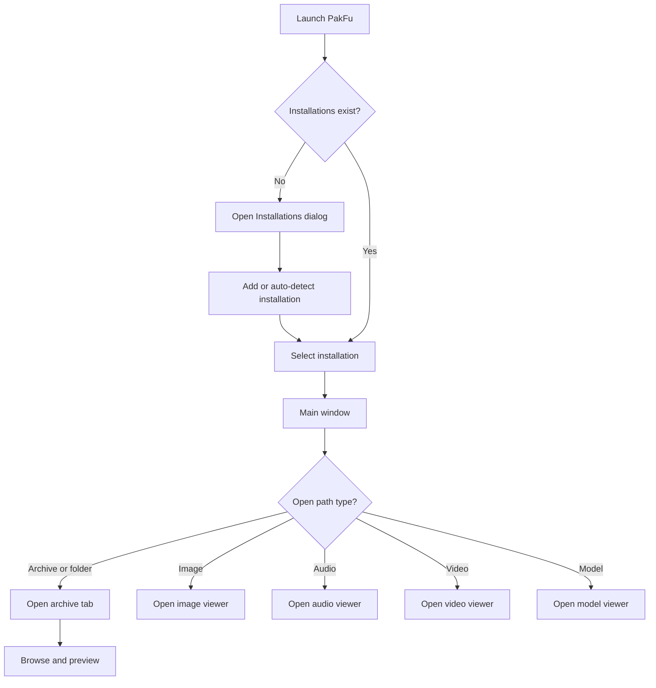
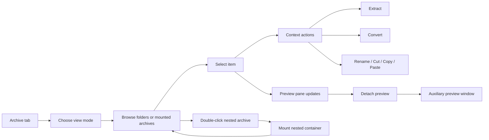
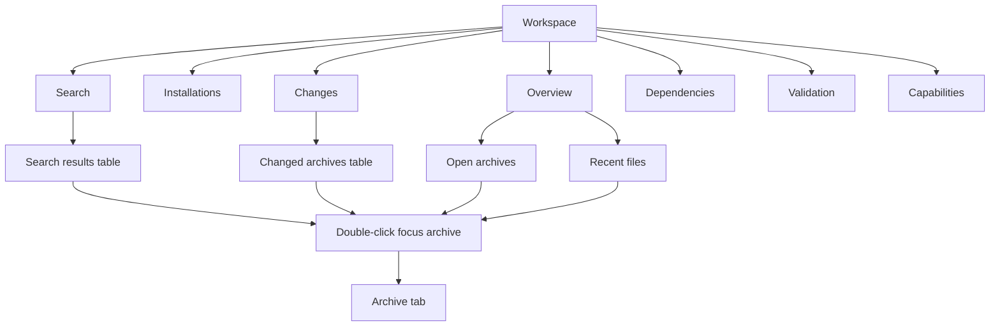

# UX and Workflow Analysis of PakFu GUI

## Executive summary

`PakFu` is already a serious desktop application, not a prototype. The repository shows a cross-platform desktop tool built on entity["organization","Qt","cross-platform sdk"] 6 Widgets and C++20, with a broad GUI surface: a startup splash screen, installation-profile management, a persistent Workspace hub, tabbed archive browsing, a rich preview pane, dedicated image/audio/video/model viewer windows, preferences, file associations, updater flows, and branded theming/icons. That breadth is a real strength because it supports the actual work modders and asset auditors do: open, inspect, compare, preview, extract, convert, and manage game-specific working contexts. fileciteturn63file0L1-L1 fileciteturn11file0L1-L1 fileciteturn23file0L1-L1 fileciteturn24file0L1-L1 fileciteturn25file0L1-L1 fileciteturn26file0L1-L1 fileciteturn27file0L1-L1

The main UX problem is not missing features. It is **information architecture pressure**. The product currently spreads core tasks across several parallel patterns at once: top-level tabs, a Workspace tab containing seven more tabs, archive-tab browsing, auxiliary viewer windows, and multiple modal dialogs. The result is capable, but cognitively heavy. The app feels like a well-stocked workshop without a sufficiently strong front-of-house layout. That is most visible in the Workspace surface, which combines a dense action row with seven sub-sections, and in archive workflows that depend on several different surfaces for browse, inspect, configure, and confirm actions. fileciteturn30file0L1-L1 fileciteturn63file0L1-L1

The best near-term path is **not** a ground-up rewrite. The highest-value moves are structural and incremental: introduce a clearer desktop navigation hierarchy; reduce modal interruptions; make archive-tool actions responsive and overflow-safe; harden accessibility with explicit focus, target size, contrast, and semantic naming; add a real internationalization foundation; and move the largest data-heavy browsers from convenience widgets toward Qt’s model/view architecture. Those changes align with current guidance from entity["company","Apple","technology company"] Human Interface Guidelines, entity["company","Microsoft","software company"] Fluent 2, entity["company","Google","software company"] Material guidance, and entity["organization","W3C","web standards body"] WCAG 2.2. citeturn3search0turn3search1turn3search2turn4search5turn4search8turn9search0turn9search1turn9search2turn8search0turn8search3turn8search6turn4search0turn10search0turn10search4turn10search2

The strongest elements to preserve are the ones that already differentiate PakFu: dedicated media/model viewers, native file dialogs, installation-aware workflows, detached previewing, cross-surface persistence, and the breadth of preview formats across the entity["video_game","Quake","1996 fps"] family and adjacent titles. The redesign should make those strengths easier to discover and safer to use, not replace them. fileciteturn63file0L1-L1 fileciteturn41file0L1-L1 fileciteturn50file0L1-L1

## Assumptions and evidence base

This report assumes PakFu is primarily a **desktop productivity tool for experienced modders, archivists, reverse-engineering enthusiasts, and technical content auditors**, with Windows likely the highest-priority user base because shell integration is most complete there, while macOS and Linux remain first-class supported platforms. It also assumes analytics are not yet deeply instrumented in the GUI, because the repository surfaces strong build/release automation and QA checklists but not an obvious product-analytics layer in the audited GUI code. fileciteturn63file0L1-L1 fileciteturn52file0L1-L1 fileciteturn40file0L1-L1

The evidence base is a static audit of the public repository snapshot and related docs. The most important sources were the README and build graph; `main.cpp`; `workspace_tab.cpp`; `preferences_tab.cpp`; `preview_pane.h`; dedicated viewer windows; theme and icon files; installation and file-association dialogs; and the file-ops QA checklist. I also used official design and accessibility guidance for desktop patterns, accessibility, and internationalization. I did **not** execute the app, install packages, or capture runtime screenshots in this pass, so visual judgments are based on code structure, declared widgets, assets, and styles rather than live rendering. fileciteturn63file0L1-L1 fileciteturn58file0L1-L1 fileciteturn30file0L1-L1 fileciteturn31file0L1-L1 fileciteturn23file0L1-L1 fileciteturn29file0L1-L1 fileciteturn38file0L1-L1 fileciteturn40file0L1-L1

That limitation matters in three places. First, contrast and focus findings are partly inferential because the theme system is palette-driven and some final visuals would depend on runtime rendering. Second, performance conclusions are tied to architecture and widget choices, not measured frame time or memory usage. Third, because the available tools exposed code and asset manifests more readily than rendered GUI captures, this report includes **recommended visual assets to create** rather than embedded screenshots of every screen state. fileciteturn29file0L1-L1 fileciteturn42file0L1-L1 fileciteturn43file0L1-L1

## Current GUI audit

The current GUI surface is broad and logically composable, but it is also fragmented. The application launches through a branded splash screen, conditionally opens an Installations dialog if no profile exists, restores or selects an active installation, then shows the main window. The main app distinguishes archives, folders, and directly openable media/model/asset paths; it supports single-instance shell-open behavior; and it routes supported files into dedicated viewer windows when appropriate. That core shell/open workflow is well conceived and very desktop-native. fileciteturn53file0L1-L1 fileciteturn50file0L1-L1 fileciteturn58file0L1-L1

The most consequential screen today is the Workspace tab. Its structure is rich: a top action row with **New, Open File, Open Archive, Open Folder, Installations, Refresh**; a summary block; and a second-level `QTabWidget` containing **Overview, Installations, Search, Changes, Dependencies, Validation, Capabilities**. This gives the user a lot of power, but it also creates an app-within-the-app feeling. Platform guidance generally treats tabs as a way to switch among a **small set of closely related peer sections**, while sidebars or split navigation become more appropriate for broader desktop information hierarchies. PakFu’s Workspace exceeds the comfortable tab threshold and would benefit from being reframed as a persistent left navigation surface with richer center-pane content. fileciteturn30file0L1-L1 citeturn3search0turn3search4turn4search5

Preferences are strong in scope and decent in organization. The Preferences surface groups settings into **Appearance, Workspace & Archives, 3D Preview, Images & Text, Updates**, and many options apply immediately to open views. This is good product thinking because it reduces restart friction and makes the app feel responsive to user intent. The downside is that the current preferences surface is also very long and option-dense, especially around previews. It needs stronger progressive disclosure, clearer defaults, and better distinction between “everyday controls” and “expert tuning.” fileciteturn31file0L1-L1 fileciteturn63file0L1-L1

The preview architecture is one of the repository’s strongest UX assets. `PreviewPane` declares a structured overview-and-content system with modes for message, text, shader, font, audio, cinematic, video, BSP, model, image, and sprite content; rich header metadata; overview cards; image background/layout controls; text wrapping; audio transport; 3D scene controls; and fullscreen behavior. This suggests a mature inspection model that can become the backbone of a more coherent “right-side inspector” UX. The dedicated image/audio/video/model viewer windows reinforce that strength by giving secondary content its own focused auxiliary window, which aligns with Apple’s guidance that auxiliary windows work best when they are dedicated to one task or one content area. fileciteturn23file0L1-L1 fileciteturn48file0L1-L1 fileciteturn24file0L1-L1 fileciteturn25file0L1-L1 fileciteturn26file0L1-L1 fileciteturn27file0L1-L1 citeturn3search1

The dialog layer is functional but overused. The repository defines dialogs for installation selection, installation editing, file associations, about/branding, confirmation, and archive-open decision points. Official guidance across Fluent and Material is consistent here: dialogs are interruptions, so they should be reserved for moments where the user genuinely needs to decide, confirm, or complete a short focused task; informational and non-critical status should often be surfaced inline or as lightweight notifications instead. PakFu’s current architecture is capable of this shift because it already has persistent panels, preview cards, status bars, and workspace tabs that can absorb more of the load currently handled by modals. fileciteturn50file0L1-L1 fileciteturn51file0L1-L1 fileciteturn52file0L1-L1 fileciteturn49file0L1-L1 citeturn4search8turn9search2turn8search3turn7search0

Styling is a mixed picture. On the positive side, the application has a coherent theme manager, a branded icon system with custom SVG resources, a clear file-association icon taxonomy by extension, and native-dialog persistence utilities. On the negative side, the theme layer currently mixes base palette theming with ad hoc gradients and novelty theme naming (`CreamyGoodness`, `VibeORama`, `DarkMatter`), which weakens the product’s “expert desktop tool” tone. The styling also emphasizes hover states more than focus states, uses very small `QToolButton` padding, and includes some hard-coded stylistic colors that could become problematic across themes and at larger scaling. fileciteturn28file0L1-L1 fileciteturn29file0L1-L1 fileciteturn38file0L1-L1 fileciteturn39file0L1-L1 fileciteturn41file0L1-L1

The table below summarizes the main audited GUI surfaces.

| Surface | What exists now | UX value | Main issues |
|---|---|---|---|
| Splash | Branded splash with spinner, status text, version text | Good startup identity and feedback | Purely visual; no added accessibility semantics visible in audited code |
| Installations chooser | List of profiles, add/configure/remove/auto-detect/open | Strong first-run path | Dense and modal; hint styling is hard-coded |
| Installation editor | Form with game, dirs, palette, launch settings | Good setup coverage | Long form; validation is message-box based rather than inline |
| Workspace | Action row, summary, seven sub-tabs, tables for health/search/changes | Powerful control center | Too many destinations for tabs; toolbar likely overflows on narrow widths |
| Archive tab | Multi-view file browser, breadcrumbs, drag/drop, undo/redo, preview detach | Core differentiator | Likely high complexity and discoverability burden |
| Preview pane | Multi-mode inspector with media and 3D controls | Excellent inspection foundation | Needs stronger hierarchy and clearer default states |
| Dedicated viewers | Auxiliary windows with previous/next/fullscreen and status | Great for focused inspection | Repetition across windows suggests shared chrome could be standardized |
| Preferences | Five major groups | Good logical grouping | Heavy expert density; weak “basic vs advanced” separation |
| File associations | Category tabs per file type | Strong system integration UI | Category count is high; non-Windows path becomes a mostly disabled dialog |
| About | Fixed-size branded modal | Branding and links are clear | Fixed `460x700` layout is rigid and localization-hostile |

The most important accessibility issues visible in the audited code are concrete enough to act on immediately. `QToolButton` padding is set to `2px`, hover styling is defined but explicit focus styling is not, several helper labels use subdued palette colors, and at least one major dialog uses a fixed size. WCAG 2.2 emphasizes minimum target size, visible focus, and sufficient contrast for meaningful interface states, while Qt explicitly recommends scalable UI and keyboard-accessible navigation. PakFu is already close enough architecturally that these are mostly systematic cleanup tasks, not product-level blockers. fileciteturn29file0L1-L1 fileciteturn49file0L1-L1 fileciteturn50file0L1-L1 fileciteturn31file0L1-L1 citeturn4search1turn4search6turn4search0turn10search0turn10search4turn10search3

## User workflows and task flows

The current “start, select context, open content” workflow is structurally sound. First-run users are pushed through installation setup; returning users reopen directly into their selected context; shell-open, drag-and-drop, and CLI-open paths converge into the same main-window routing logic; and dedicated viewers can bypass archive browsing when the user’s intent is clearly file inspection rather than package management. That is the right overall shape. The friction comes later, when task depth forces the user to navigate between several parallel surfaces. fileciteturn58file0L1-L1 fileciteturn50file0L1-L1 fileciteturn63file0L1-L1



That startup flow is especially strong because it preserves context. Installations are not just preferences; they influence default folders, palette handling, launch settings, recent-file partitioning, and installation-aware operations. The key UX improvement here is to reduce the number of confirmations between “I have a file” and “I can inspect it.” External archives should default to **Quick Inspect** unless the user explicitly opts into install-copy/move behavior. fileciteturn50file0L1-L1 fileciteturn51file0L1-L1 fileciteturn63file0L1-L1

The archive workflow is where PakFu’s power and complexity peak. The app supports multiple view modes, breadcrumbs, mounted nested archives, selection semantics, drag/drop, cut/copy/paste, extraction, conversion, and detach-able previews. This is exactly the sort of workflow where a stronger desktop information architecture pays off because users often oscillate between **browse**, **inspect**, **compare**, and **act** in rapid succession. Fluent and Apple both favor keeping the major hierarchy stable and the current-task controls grouped and predictable; PakFu should lean harder into that pattern. fileciteturn56file0L1-L1 fileciteturn54file0L1-L1 fileciteturn55file0L1-L1 fileciteturn40file0L1-L1 citeturn9search0turn3search2turn3search0



The Workspace workflow is currently useful but not elegant. Search, change review, dependency notes, validation, and capability reporting are all valuable, but a seven-tab substructure makes them feel like parallel modules rather than one coherent control center. In practice, these are all different **lenses on the same active working set**. The better pattern is a left-hand “workspace lens” or filter area, with the center pane changing summary cards and result sets while preserving a consistent toolbar and selection model. Apple explicitly recommends sidebars for broad, flat desktop hierarchies, and Fluent’s search guidance also supports making search/filtering a stable, predictable part of layout rather than hiding it in a destination tab. fileciteturn30file0L1-L1 citeturn3search0turn9search1



## Prioritized improvements

The table below is ordered from smaller refinements to more structural redesigns. It synthesizes the audited repo state with official design and accessibility guidance. fileciteturn30file0L1-L1 fileciteturn31file0L1-L1 fileciteturn29file0L1-L1 fileciteturn56file0L1-L1 citeturn3search0turn3search2turn4search5turn4search8turn9search0turn9search1turn9search2turn10search0turn10search4

| Priority | Scale | Improvement | Rationale and UX principle | Expected impact | Effort | Risk |
|---|---|---|---|---|---|---|
| Highest | Minor | Add explicit keyboard focus styling across all interactive controls | Current QSS defines hover states more strongly than focus states. Visible focus is essential for keyboard reliability and assistive tech confidence. | High | Low | Low |
| Highest | Minor | Increase minimum hit area for toolbar and icon actions | `QToolButton` padding is too small for comfortable pointer use and likely too tight against WCAG target-size guidance. | High | Low | Low |
| Highest | Minor | Replace noncritical modal alerts with inline status surfaces or toasts | Dialogs interrupt flow; success/progress/error states that do not require a decision should not steal attention. | High | Medium | Low |
| Highest | Medium | Add overflow behavior to action rows and viewer toolbars | Workspace and viewer toolbars are action-dense but not visibly designed for narrow widths. | High | Medium | Low |
| Highest | Medium | Introduce a persistent command/search affordance | Search is present, but the strongest visible affordance is inside Workspace. A global quick-open/search command improves discoverability and speed. | High | Medium | Medium |
| Highest | Medium | Reframe external archive open as “Quick Inspect” first | Installation-aware copy/move is valuable, but inspection should be the default for low-friction first contact. | High | Medium | Medium |
| High | Medium | Split preferences into Basic and Advanced disclosure states | The current settings surface is strong but dense; progressive disclosure lowers cognitive load. | Medium | Medium | Low |
| High | Medium | Standardize viewer chrome across image/audio/video/model windows | These windows are similar enough that a shared header/toolbar/status shell would improve consistency and reduce maintenance. | Medium | Medium | Low |
| High | Sweeping | Replace Workspace inner tabs with a sidebar-driven control center | Seven peer tabs are too much for a top tab bar; a sidebar better fits broad desktop hierarchy and keeps context stable. | Very high | High | Medium |
| High | Sweeping | Move large archive/workspace browsers to Qt model/view | Item-based convenience widgets are simpler but weaker for large datasets, incremental fetch, and multiple synchronized views. | Very high | High | Medium |
| High | Sweeping | Turn PreviewPane into a first-class right-side inspector pattern | The code already has the ingredients. Elevating the preview/metadata panel would improve browse-inspect-act loops dramatically. | Very high | High | Medium |
| Medium | Sweeping | Introduce a tokenized design system layer for themes and states | Current themeing is workable but mixes palette, gradients, and one-off styles. A token layer will improve contrast control, portability, and consistency. | High | High | Medium |
| Medium | Sweeping | Build internationalization into the app shell now | Hard-coded English strings are pervasive; delaying i18n raises eventual rewrite cost. | High | High | Medium |
| Medium | Sweeping | Add accessible semantics for custom widgets and status messaging | Custom preview, drag/drop, and splash surfaces need explicit semantics if the app is to be robust with screen readers. | High | High | Medium |

The most important product decision inside that table is this: **do not treat accessibility, i18n, and IA cleanup as polish work**. In PakFu’s case, they are architecture work. The app already has enough capability that clarity, consistency, and semantic structure will produce a disproportionate gain in perceived quality. fileciteturn23file0L1-L1 fileciteturn31file0L1-L1 fileciteturn58file0L1-L1

## Design system proposals

The right visual direction for PakFu is a **professional technical desktop workbench** with restrained personality, not a novelty-skinned utility. The repository’s existing branding, icon work, and file-format visual language are good foundations, but the app should present itself first as a precise inspection and archive-management tool. Keep the humor and flavor in the brand and optional themes; make the default experience intentionally sober, legible, and task-led. That better matches the product’s real strengths. fileciteturn49file0L1-L1 fileciteturn28file0L1-L1 fileciteturn38file0L1-L1 fileciteturn39file0L1-L1

The best layout direction is a **three-pane desktop shell**:

- **Left pane:** primary navigation and task lenses — Workspace, Archives, Search, Changes, Validation, Settings.
- **Center pane:** current working surface — archive browser table/grid, search results, installation list, or conversion setup.
- **Right pane:** preview + metadata inspector — asset overview, palette provenance, dependency hints, audio/video/model controls, preview fallback notes.

This aligns PakFu with a common expert-desktop pattern: stable hierarchy on the left, working content in the middle, contextual inspection on the right. Apple’s sidebar guidance, Apple’s window/toolbars guidance, and Fluent’s drawer/toolbar guidance all support this pattern for dense productivity tasks. citeturn3search0turn3search1turn3search2turn9search0turn9search3

Typography should remain system-native by default. Qt already benefits from platform fonts and scalable layout infrastructure; the app should lean into that rather than visually “branding” text too hard. Use three clear levels only: window titles, section headers, and body text. The repo already sets oversized title text in several dialogs and screens; the improvement is to normalize that into a reusable type scale instead of repeating local font tweaks. Keep labels short, sentence case, and specific; Fluent’s guidance on dialog and toolbar wording is particularly relevant here. fileciteturn31file0L1-L1 fileciteturn50file0L1-L1 fileciteturn51file0L1-L1 citeturn4search8turn9search0

Color should be tokenized into a small semantic system: surface, surface-raised, border, text-primary, text-secondary, accent, success, warning, error, selection, focus, and preview scrim. In the current repo, several custom palettes are likely to be visually fun but harder to guarantee for contrast and consistency. The redesign should preserve theme variety, but only after a reference token set is established and contrast-tested across text, controls, selection, and disabled states. WCAG contrast and non-text contrast requirements make this work much less subjective than it might look. fileciteturn29file0L1-L1 citeturn10search3turn10search4

Iconography is a strength worth keeping. The repo already maintains a coherent custom SVG icon set and a file-association icon language by extension. The opportunity is not to replace icons, but to use them more selectively. Keep text-plus-icon for primary archive actions, retain icon-only controls only where the meaning is standard and reinforced by tooltip or label, and standardize active/hover/focus/disabled states. Fluent explicitly recommends not forcing users to guess at icon meaning, especially inside dense toolbars. fileciteturn37file0L1-L1 fileciteturn38file0L1-L1 fileciteturn39file0L1-L1 citeturn9search0

Microinteractions should be quiet and informative. PakFu does not need expressive motion; it needs **state legibility**. Recommended behaviors are straightforward: subtle hover elevation; high-contrast focus ring; clear selected-row and selected-thumbnail states; drag-enter and drop-target highlighting; inline progress for long export/convert operations; toasts or message bars for non-blocking completion/error states; and sticky preview-header metadata when the body content scrolls. Material, Fluent, and WCAG all converge on the same underlying principle: preserve context, communicate status, and do not hide the user’s current locus of attention. citeturn8search3turn9search2turn10search2

A practical mockup set for design and QA should include these visual assets:

| Asset to create | Why it matters |
|---|---|
| Workspace current-state capture at default size | Baseline for IA comparison |
| Workspace at narrow width and 200% scale | Exposes overflow and scaling issues |
| Archive tab in details, icons, and gallery modes | Validates browse density and discoverability |
| Preview inspector for image, model, and text assets | Confirms right-pane hierarchy |
| Installations chooser and editor | Validates first-run/onboarding clarity |
| Preferences basic vs advanced prototype | Tests progressive disclosure |
| File associations on Windows and non-Windows | Clarifies platform-specific UX |
| Focus-state visual sheet | Accessibility acceptance artifact |
| Theme token sheet across light/dark/high-contrast | Ensures visual consistency |

For implementation, PakFu should move from ad hoc widget-level styling toward a small design-system layer: a C++ token struct feeding `QPalette`, a generated QSS layer for spacing/state styling, and a library of reusable component wrappers for section headers, message bars, metadata rows, preview cards, and toolbar groups. Qt’s styling model is not web CSS, so the goal is **controlled QSS plus palette discipline**, not sprawling stylesheet logic. fileciteturn29file0L1-L1 citeturn4search1

A useful QSS sketch for the first pass would look like this:

```css
QToolButton, QPushButton {
    min-height: 28px;
    padding: 6px 10px;
    border-radius: 8px;
}

QToolButton:hover, QPushButton:hover {
    background: rgba(127,127,127,40);
}

QToolButton:focus, QPushButton:focus,
QLineEdit:focus, QComboBox:focus,
QTreeView:focus, QListView:focus, QTableView:focus {
    border: 1px solid palette(highlight);
    outline: none;
}

QLabel[role="secondary"] {
    color: palette(mid);
}

QFrame[role="card"] {
    border: 1px solid palette(mid);
    border-radius: 10px;
    background: palette(base);
}
```

That code sketch is deliberately simple. The point is to standardize spacing and focus treatment first, then refine visual polish after the semantics and layout hierarchy are stable. fileciteturn29file0L1-L1 citeturn4search0turn10search0turn10search4

## Accessibility, internationalization, and technical considerations

Accessibility improvements should begin with **input reliability**. The current theme layer uses tiny toolbutton padding and defines hover states more explicitly than focus states. That is a common desktop-app oversight, and it is fixable centrally. Every interactive component should have a visible focus treatment, minimum hit area, predictable tab order, mnemonic or shortcut path where appropriate, and a state presentation that does not rely on color alone. WCAG 2.2’s focus appearance, target size, contrast minimum, and non-text contrast requirements are directly applicable as working design thresholds even in a native desktop app. fileciteturn29file0L1-L1 citeturn4search0turn10search0turn10search3turn10search4

The second accessibility priority is **semantic exposure for custom and complex widgets**. Qt provides a substantial accessibility framework for widget applications, but custom surfaces often need additional help. PakFu’s custom preview surfaces, detached preview windows, drag/drop interactions, spinner splash, and file-association rows deserve explicit accessible names, descriptions, and status announcements rather than relying entirely on default widget semantics. In practice, that means using `setAccessibleName`, `setAccessibleDescription`, `setBuddy`, and, where needed, custom accessible interfaces for higher-complexity components. Status messaging should also be exposed programmatically so users do not need to visually detect a changed label or notice that a non-modal status line updated. fileciteturn23file0L1-L1 fileciteturn53file0L1-L1 fileciteturn52file0L1-L1 citeturn4search6turn4search7turn10search2

The third accessibility priority is **contrast under custom themes**. PakFu’s palette set is broad and playful, and some helper text uses `palette(mid)` or hard-coded RGBA styling. That is exactly where mature design systems move from artisanal choices to tokenized testing. The app needs a contrast matrix for body text, secondary text, borders, selection, focus rings, disabled controls, tooltips, and media controls across every bundled theme. Without that, the app will feel inconsistent at best and inaccessible at worst. fileciteturn29file0L1-L1 fileciteturn31file0L1-L1 fileciteturn50file0L1-L1 citeturn10search3turn10search4

Internationalization should start now, because the repository currently reads as English-first and string-literal heavy. The audited UI files contain many literal strings, and `main.cpp` does not show a translator installation path. Qt’s guidance is unambiguous: install `QTranslator` before widgets are created, use `tr()`/`QCoreApplication::translate()` for user-visible text, and design strings for localization rather than composition-by-concatenation. PakFu should also stop encoding concepts like `"Root: %1"` or joined detail strings in ways that will become awkward in other languages. Dates, numbers, pluralization, and path presentation should go through locale-aware formatting. fileciteturn58file0L1-L1 fileciteturn30file0L1-L1 fileciteturn31file0L1-L1 fileciteturn50file0L1-L1 fileciteturn51file0L1-L1 citeturn4search3turn11search0turn11search1

On the technical side, the biggest UX-linked performance issue is data architecture. `WorkspaceTab` uses `QTableWidget` repeatedly, and `PakTab` includes convenience widgets such as `QTreeWidget` and `QListWidget`. Qt’s own documentation is clear that these convenience classes are less flexible than the model/view stack, and the model/view stack is the better path when scale, multiple views, incremental fetch, and richer coordinated editing matter. For PakFu, that means moving archive listings, search results, change lists, and capability/validation tables toward `QAbstractItemModel`-backed views over time. That would immediately improve large-project responsiveness, filtering, sorting, and multi-view consistency. fileciteturn30file0L1-L1 fileciteturn56file0L1-L1 citeturn11search4turn11search8

The preview pipeline already has encouraging technical ingredients: cached preview/export state, a background task coordinator, renderer fallback logic, native file-dialog persistence, and dedicated media/model viewers. Those should be preserved. The roadmap should not destabilize the parts of the app that already feel mature: single-instance routing, native dialogs, viewer windows, preview caching, and installation-aware context. The architectural changes should mostly happen in **UI composition and data plumbing**, not by rewriting core behaviors the repository already handles well. fileciteturn42file0L1-L1 fileciteturn43file0L1-L1 fileciteturn41file0L1-L1 fileciteturn48file0L1-L1 fileciteturn58file0L1-L1

## Implementation roadmap and validation

A realistic roadmap is a staged modernization, not a single “big redesign.”

| Milestone | Duration | Primary roles | Deliverables |
|---|---|---|---|
| Audit-to-system foundation | 2 weeks | UX lead, design system engineer, Qt lead, QA | Screen inventory, token map, accessibility gap list, component naming plan, telemetry plan |
| Shell and component cleanup | 3 weeks | Qt lead, frontend/UI engineer, QA | Focus states, target sizes, toolbar overflow, message-bar/toast component, standardized section/card components |
| Navigation and workflow redesign | 4 weeks | UX lead, Qt lead, product engineer, QA | Workspace sidebar prototype, quick-open/command palette, quick-inspect archive open flow, preview inspector layout |
| Data-view refactor | 4 weeks | Qt lead, performance engineer, QA | First model/view migration for workspace tables and one archive surface, benchmark harness, sorting/filtering parity |
| Accessibility and i18n foundation | 3 weeks | Accessibility specialist, Qt engineer, QA, localization engineer | `tr()` conversion pass for app shell, translator bootstrap, accessible names/descriptions, keyboard QA matrix |
| Validation and release hardening | 2 weeks | QA lead, UX researcher, release engineer | Usability sessions, regression matrix, contrast audit, scale audit, crash/perf comparison, release notes |

Each milestone should ship with a short acceptance checklist.

| Area | QA checklist |
|---|---|
| Keyboard | Every primary workflow can be completed without a mouse; focus is always visible; dialogs return focus to invoker |
| Pointer | Primary controls meet minimum target size or spacing; drag/drop targets always highlight clearly |
| Contrast | Text, icons, borders, focus rings, and disabled states pass agreed thresholds in all bundled themes |
| Layout | No clipped labels/buttons at narrow widths, large system fonts, or 200% scaling |
| Status | Success, progress, and error states appear without unnecessary modals and are exposed accessibly |
| i18n | No concatenated user-visible strings; no fixed-height text containers that clip translated labels |
| Performance | Large archive lists remain responsive; sort/filter/update do not visibly stall the UI thread |
| Consistency | Same verbs, same icon meanings, same confirmation patterns across workspace, archive tabs, and viewers |

To validate success, PakFu should add basic UX instrumentation if it does not already exist. The most useful metrics are operational, not vanity metrics.

| Metric | Why it matters | Suggested target |
|---|---|---|
| Time to first successful open | Measures startup/onboarding friction | Down by 20–30% |
| Time to first successful extract | Measures task clarity in archive UI | Down by 15–25% |
| Archive-open prompt bypass rate | Tests success of Quick Inspect default | Majority of inspection workflows bypass extra modal decisions |
| Search adoption rate | Measures discoverability of search | Meaningful increase after adding persistent search affordance |
| Undo/redo usage | Measures editing confidence and discoverability | Stable or increased after workflow cleanup |
| Keyboard-only task completion | Measures operability/accessibility | Near parity with mouse for core tasks |
| Error-dialog rate per session | Measures interruption burden | Down materially after inline status design |
| Crash-free session rate during large archive browsing | Measures technical improvement | Upward trend after model/view migration |

A/B or staged validation ideas should focus on the highest-friction surfaces:

| Test idea | Variant A | Variant B | Success signal |
|---|---|---|---|
| Archive open flow | Current prompt-first | Quick Inspect default with secondary install action | Faster first-open and lower cancellation |
| Workspace hierarchy | Seven top tabs | Sidebar with center-lens layout | Faster navigation to Search/Changes/Validation |
| Status communication | Modal completion dialogs | Inline message bars/toasts | Lower interruption, equal or better task success |
| Search placement | Search inside Workspace only | Global command/search affordance | Higher search use and shorter path-to-result |
| Preview layout | Current blended preview controls | Stable right-side inspector | Better browse-inspect efficiency and fewer context switches |

Open questions remain, and they are worth naming explicitly. The biggest unresolved item is **runtime reality**: which parts of the current GUI feel better or worse in motion than the code suggests. The second is **scale threshold**: how large an archive or search result set must get before the convenience-widget architecture becomes noticeably painful. The third is **theme compliance**: which bundled themes already pass contrast thresholds and which do not. Those are not reasons to delay action; they are the first things to measure in the next design/development sprint. fileciteturn29file0L1-L1 fileciteturn30file0L1-L1 fileciteturn56file0L1-L1 citeturn10search3turn10search4turn11search4